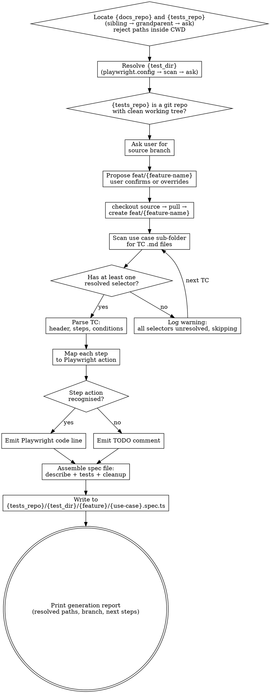

# Generate Test Suite from Test Plan

Reads TC files from the docs/wiki repo at `{docs_repo}/test-plans/{feature}/{use-case}/`, parses each TC's Steps table, maps actions to Playwright TypeScript code, and outputs one `.spec.ts` file per use case sub-folder into the tests repo at `{tests_repo}/{test_dir}/{feature}/{use-case}.spec.ts` — on a freshly created `feat/{feature-name}` branch.

<HARD-GATE>
Do NOT generate test code for any TC that has `(discovered by explorer)` selectors on every interaction step. At least one step must have a resolved selector. TCs with all placeholders produce nothing but TODOs — flag them and skip.
</HARD-GATE>

<HARD-GATE>
Do NOT write spec files until a fresh `feat/{feature-name}` branch has been created in the resolved `{tests_repo}` from a source branch the user explicitly chose. Never write to whatever branch happens to be checked out.
</HARD-GATE>

<HARD-GATE>
Do NOT create any directory or write any file until `{tests_repo}` has been resolved to an absolute path that is **outside** the current working directory and confirmed to be a separate git repo. If the discovery cascade in Step 1 fails, STOP and ask the user. NEVER create a `tests/`, `e2e/`, or any other folder inside the repo the skill is invoked from. The same rule applies to `{docs_repo}` — it must resolve outside CWD before any reads. This gate exists because past runs have silently created `./tests/` inside the UI repo when discovery failed; this is the single most damaging failure mode this skill can produce.
</HARD-GATE>

---

## Workspace Layout Assumption

This skill assumes a multi-repo workspace where the docs/wiki repo and the tests repo live **alongside** the UI and API repos — typically as siblings, sometimes one level higher:

```
workspace/
  ui/        ← frontend repo (skill may be run from here)
  api/       ← backend repo (skill may be run from here)
  docs/      ← wiki / knowledge repo (TC files live here — read-only input)
  tests/     ← Playwright test repo (spec files land here — write target)
```

Or a nested layout where the docs/tests repos sit at the workspace root:

```
workspace/
  frontend/
    ui/      ← skill may be run from here
  backend/
    api/     ← skill may be run from here
  wiki/      ← docs repo lives here
  e2e/       ← tests repo lives here
```

Common names for the docs/wiki repo: `docs`, `wiki`, `knowledge`, `kb`, `documentation`.
Common names for the tests repo: `tests`, `test`, `e2e`, `qa`, `qa-automation`, `playwright`, `playwright-tests`, `automation`.

The skill discovers both paths automatically (Step 1) and asks the user when discovery is ambiguous or fails. Throughout this skill the resolved paths are referred to as `{docs_repo}` and `{tests_repo}`.

**Inside the tests repo**, the actual spec files live in a directory configured by `playwright.config.ts` (the `testDir` field). This skill resolves that directory as `{test_dir}` (Step 2) so spec files land where Playwright actually looks for them.

---

## Overview

This skill is the bridge between test plans (documentation) and test suites (executable code). It reads the structured TC files produced by `skill:generate-test-plan`, infers Playwright actions from the step text, and emits TypeScript into a separate tests repo on a feature branch.

**Core principles:**
- Generate only what the TC defines. Never fabricate selectors, invent steps, or add assertions the TC doesn't specify.
- Always work on a fresh `feat/{feature-name}` branch in the tests repo. Never write spec files onto an arbitrary branch.
- Don't auto-commit or push. Branch creation + file writes only — the user reviews and commits.
- Resolve the tests repo and its test directory from real config (`playwright.config.ts`), not assumptions.

---

## Anti-Pattern: "I'll Add a Few Extra Assertions"

When generating code for a TC that checks "toast appears", it's tempting to also assert the toast disappears after 3 seconds, or that the list count incremented. Don't. The TC is the contract. If an assertion isn't in the Steps table, it doesn't belong in the generated code. File an issue or add a note — don't silently expand scope.

---

## Anti-Pattern: "I'll Just Write to the Current Branch"

When the tests repo already has a branch checked out (maybe `main`, maybe a stale feature branch), it's tempting to skip the branch dance and just write files. Don't. Generated specs land on a clean, named feature branch every time so the user can diff, review, and PR cleanly. Even if the user "just wants the files", create the branch.

---

## Anti-Pattern: "I'll Just Create `./tests/` Here"

When the discovery cascade can't find a sibling tests repo, the worst possible failure mode is to silently create a `tests/` folder inside the current working directory and write spec files there. **This is the bug Step 1 + the third hard gate exist to prevent.** A `tests/` folder inside the UI or API repo:
- Pollutes the source repo with files that don't belong to it
- Won't be picked up by the actual Playwright runner (which lives in the real tests repo)
- Won't be on the `feat/{feature-name}` branch (because it's a different repo entirely)
- Creates the illusion that the skill "worked" when it produced nothing useful

If discovery fails, STOP and ask. Always.

---

## Anti-Pattern: "I'll Write to the Tests Repo Root"

Even when `{tests_repo}` resolves correctly, writing to `{tests_repo}/{feature}/{use-case}.spec.ts` is wrong if the repo's `playwright.config.ts` has `testDir: './tests'` or similar. Playwright won't pick up the files. Always resolve `{test_dir}` first (Step 2) and write to `{tests_repo}/{test_dir}/{feature}/{use-case}.spec.ts`.

---

## When to Use

**Use when:**
- User asks to generate Playwright tests from the test plan
- A selector was updated in a TC and the spec file needs to be regenerated
- User asks to generate tests for a specific feature or use case

**Do NOT use when:**
- TCs have no resolved selectors — the output will be all TODOs
- User wants to create or modify the test plan itself → use `skill:generate-test-plan`
- User wants to run tests → that's `npx playwright test`
- The tests repo cannot be located even after asking the user — stop

---

## Input / Output Mapping

```
INPUT:  {docs_repo}/test-plans/{feature}/{use-case}/{feature}-TC-NNN.md   (read-only)
OUTPUT: {tests_repo}/{test_dir}/{feature}/{use-case}.spec.ts              (on feat/{feature-name} branch)
```

**Concrete example** (`{docs_repo}=../wiki`, `{tests_repo}=../e2e`, `{test_dir}=tests`):
```
../wiki/test-plans/checklist/display/checklist-TC-001.md  ─┐
../wiki/test-plans/checklist/display/checklist-TC-002.md  ─┤→ ../e2e/tests/checklist/display.spec.ts
                                                            │
../wiki/test-plans/checklist/add/checklist-TC-003.md      ─┐
../wiki/test-plans/checklist/add/checklist-TC-004.md      ─┤→ ../e2e/tests/checklist/add.spec.ts
                                                            │
../wiki/test-plans/checklist/delete/checklist-TC-006.md   ─┘→ ../e2e/tests/checklist/delete.spec.ts
```

All output files land on a single `feat/{feature-name}` branch (e.g. `feat/checklist`) created in `{tests_repo}`.

---

## TC File Input Format

The skill expects TC files in this exact format (produced by `skill:generate-test-plan`):

```markdown
# {feature}-TC-{NNN}: {Title} ({Category})

**Feature:** {Feature Name}
**Scenario:** {Letter} — {Scenario description}
**Priority:** {High | Medium | Low}
**Type:** Functional
**Tags:** @smoke @{feature} @{feature}-TC-{NNN}

---

## Steps

| # | Step | Selector | Expected Result |
|---|------|----------|-----------------|
| 1 | Navigate to /path | `n/a` | Page loads |
| 2 | Click "Save" button | `[data-testid="btn-save"]` | Record saved |

---

## Preconditions
- ...

## Postconditions
- ...
```

---

## Checklist

You MUST complete these in order:

1. **Locate `{docs_repo}` and `{tests_repo}`** — run the discovery cascade for both (sibling → grandparent → ask), reject any path inside CWD
2. **Resolve `{test_dir}` inside `{tests_repo}`** — read `playwright.config.{ts,js,mjs}`, fall back to folder scan, then ask
3. **Verify tests repo is a git repo** — `{tests_repo}/.git` must exist and the working tree must be clean (or warn user)
4. **Ask user for source branch** — which branch should the new feature branch be based on?
5. **Confirm feature branch name** — propose `feat/{feature-name}`, let user override
6. **Create the feature branch** — checkout source, pull, then create the new branch
7. **Read TC files** — scan the target use case sub-folder for all `.md` files
8. **Check selector coverage** — skip any TC where every interaction step is `(discovered by explorer)`
9. **Parse each TC** — extract header fields, steps table, preconditions, postconditions
10. **Map steps to Playwright** — infer action type from step text, apply code mapping
11. **Assemble spec file** — wrap all tests in a `test.describe()` with shared setup
12. **Write spec file** — output to `{tests_repo}/{test_dir}/{feature}/{use-case}.spec.ts` on the new branch
13. **Print generation report** — show resolved paths, what was generated, what was skipped, branch name, next steps

---

## Process Flow



---

## The Process

### Step 1: Locate `{docs_repo}` and `{tests_repo}`

The TC files must be read from a docs/wiki repo, and the spec files must land in a tests repo. Both must be located **outside** the current working directory. Run the same cascade for each, in this order — stop at the first match:

**1a. Check the conventional sibling path.**
- For docs: test `../docs/`. Accept if it exists and contains `.git/` or a `test-plans/` directory from a prior run.
- For tests: test `../tests/`. Accept if it exists and contains `.git/`.

**1b. Scan for sibling repos with conventional names.**
- From the parent of the current working directory, list immediate subdirectories.
- Docs candidates: `docs`, `wiki`, `knowledge`, `kb`, `documentation` (case-insensitive).
- Tests candidates: `tests`, `test`, `e2e`, `qa`, `qa-automation`, `playwright`, `playwright-tests`, `automation` (case-insensitive).
- Prefer real git repos (containing `.git/`) over plain folders.
- For tests: additionally prefer candidates that contain `playwright.config.{ts,js,mjs}` at the root.
- If exactly one match: accept it. If multiple matches: list them and ask the user which to use.

**1c. Walk up one more level.**
- If the current repo is nested (e.g. `workspace/frontend/ui/`), the docs/tests repos may live at the workspace root.
- Check the grandparent directory using the same name patterns and preferences as 1b.

**1d. Ask the user.**
- If 1a–1c all fail for a given repo, stop and ask:
  > "I couldn't find a docs/wiki repo near here. Where should I read the TC files from? (e.g. `../docs`, `~/work/wiki`, or an absolute path)"
  > "I couldn't find a tests repo near here. Where should I write the spec files? (e.g. `../e2e`, `~/work/playwright`, or an absolute path)"
- Validate the path the user provides — it must exist, be a directory, and (for tests) be a git repo.

**Record the resolved paths** as `{docs_repo}` and `{tests_repo}`. All subsequent operations use these absolute paths.

**CWD-containment guard (this is the critical check):**
- Resolve `{docs_repo}` and `{tests_repo}` to absolute paths.
- Resolve the current working directory to an absolute path.
- If either resolved path **starts with** the CWD path → reject. Treat as a discovery failure and fall through to 1d.
- This catches: `./tests/`, `./docs/`, `./subdir/tests/`, etc. — any path under the repo the skill was invoked from.

**Verify:**
- Both resolved paths exist and are directories.
- Neither resolved path is inside CWD (absolute-path check above).
- `{tests_repo}` contains `.git/`.
- `{docs_repo}/test-plans/` exists and is readable.

**On failure:** Stop. Ask the user. Never silently create directories in CWD as a fallback.

### Step 2: Resolve `{test_dir}` Inside `{tests_repo}`

Playwright reads test files from a directory configured by `testDir` in `playwright.config.{ts,js,mjs}`. Resolve `{test_dir}` in this order:

**2a. Read the Playwright config.**
- Check for, in order: `{tests_repo}/playwright.config.ts`, `playwright.config.js`, `playwright.config.mjs`.
- If a config file exists, extract `testDir` using a simple regex: `testDir:\s*['"]([^'"]+)['"]`.
- Resolve the value relative to `{tests_repo}` (e.g. `./tests` → `{tests_repo}/tests`).
- If the config has a `projects:` array with multiple `testDir` values, list the project names and ask the user which to target. Do not pick silently.
- If the regex misses (e.g. `testDir` is a variable or computed expression), fall through to 2b.

**2b. Scan for conventional folders.**
- If no config or no parseable `testDir`, look for these folders at `{tests_repo}` root: `tests/`, `test/`, `e2e/`, `specs/`, `__tests__/`.
- If exactly one exists: use it. If multiple exist: ask the user. If none exist: fall through to 2c.

**2c. Ask the user.**
- > "I couldn't determine where spec files should go inside `{tests_repo}`. Should I create a `tests/` directory at the root, or use a different path?"
- Validate the user's answer. If the path doesn't exist, confirm whether to create it.

**Special case — config exists but `testDir` is unset.**
- Playwright's default `testDir` is the directory containing the config (i.e. `{tests_repo}` root).
- This is unusual for non-trivial projects. Warn the user:
  > "`playwright.config.ts` exists but doesn't set `testDir`, so Playwright defaults to the repo root. Spec files would land at `{tests_repo}/{feature}/{use-case}.spec.ts`. Confirm or specify a different directory."
- Proceed only with explicit confirmation.

**Verify:**
- `{test_dir}` is an absolute path (or relative path resolvable against `{tests_repo}`).
- `{test_dir}` exists, or the user confirmed creating it.
- `{test_dir}` is inside `{tests_repo}` (not symlinked elsewhere).

**On failure:** Stop. Don't write spec files to the repo root unless the user explicitly OK'd it.

### Step 3: Verify Tests Repo is a Git Repo

- Confirm `{tests_repo}/.git` exists. If not, stop — this skill requires git for branch management.
- Run `git -C {tests_repo} status --porcelain` to check for uncommitted changes.
  - If clean, proceed.
  - If dirty, **warn the user** and list the changed files. Ask whether to (a) stash and continue, (b) abort, or (c) commit first manually. Do not auto-stash without permission.
- **Verify:** `{tests_repo}` is a git repo and the working tree is clean (or the user has authorized proceeding).
- **On failure:** Stop. Surface the dirty files. Wait for user direction.

### Step 4: Ask User for Source Branch

- Show the current state: `git -C {tests_repo} branch --show-current` and `git -C {tests_repo} branch -a | head -20`.
- Ask the user: *"Which branch should the new feature branch be based on?"* — typical answers are `main`, `master`, `develop`, or a long-lived integration branch.
- Do not assume `main` or `develop` — different teams have different conventions. Ask every time.
- Validate the answer exists: `git -C {tests_repo} rev-parse --verify {source-branch}`. If not found, list available branches and ask again.
- **Verify:** Source branch exists locally or on `origin/`.
- **On failure:** Re-prompt with the list of available branches.

### Step 5: Confirm Feature Branch Name

- Default proposal: `feat/{feature-name}` — where `{feature-name}` is the kebab-case feature name from the TC files (e.g. `feat/checklist`, `feat/service-type`).
- Show the proposal and ask the user: *"Branch name will be `feat/{feature-name}` — confirm or provide a different name."*
- If the branch already exists locally (`git -C {tests_repo} rev-parse --verify {branch-name}` succeeds), warn the user and offer:
  - (a) Switch to existing branch and add files there (no fresh branch)
  - (b) Delete and recreate from source
  - (c) Pick a different name (e.g. `feat/{feature-name}-v2`)
- Never silently overwrite an existing branch.
- **Verify:** Final branch name is in the form `feat/{...}` and is either new or the user explicitly chose to reuse it.
- **On failure:** Re-prompt.

### Step 6: Create the Feature Branch

Run, in order:

```bash
git -C {tests_repo} fetch origin
git -C {tests_repo} checkout {source-branch}
git -C {tests_repo} pull --ff-only origin {source-branch}     # if upstream exists
git -C {tests_repo} checkout -b {feature-branch}
```

- If `pull --ff-only` fails because the local source branch has diverged, stop and tell the user — don't force or rebase silently.
- If `fetch` fails (offline / no remote), warn the user and ask whether to proceed against the local source branch only.
- **Verify:** `git -C {tests_repo} branch --show-current` returns the new feature branch name.
- **On failure:** Surface the git error verbatim. Do not continue to file writes.

### Step 7: Read TC Files

- Scan `{docs_repo}/test-plans/{feature}/{use-case}/` for all `*.md` files.
- Sort by TC number (extract NNN from filename) to ensure deterministic test order.
- If the directory is empty or doesn't exist, stop and report "No TCs found."
- **Verify:** You have a sorted list of TC file paths.
- **On failure:** Check the feature and use-case names for typos. Note: at this point a feature branch has been created — tell the user, and offer to delete it (`git -C {tests_repo} checkout {source-branch} && git -C {tests_repo} branch -D {feature-branch}`).

### Step 8: Check Selector Coverage

- For each TC, count how many interaction steps (non-`n/a`) have a resolved selector vs `(discovered by explorer)`.
- If **every** interaction step is `(discovered by explorer)`, skip the TC: `⚠ Skipping {feature}-TC-{NNN}: no resolved selectors`.
- TCs with a mix of resolved and placeholder selectors are fine — placeholders become TODO comments.
- **Verify:** At least one TC has at least one resolved selector. If zero, stop and report — don't generate an empty spec file. Offer to delete the feature branch you just created.
- **On failure:** Tell the user which TCs need selector resolution (via explorer or code inspection).

### Step 9: Parse Each TC

Extract from the TC file:

```json
{
  "tc_number": "checklist-TC-001",
  "title": "Display Checklist Items (Happy Path)",
  "feature": "Checklist",
  "scenario": "A — Display items in table with all columns and controls visible",
  "priority": "High",
  "type": "Functional",
  "tags": ["@smoke", "@checklist", "@checklist-TC-001"],
  "steps": [
    { "number": 1, "step": "Navigate to checklist page", "selector": "n/a", "expected": "Page loads, title visible" },
    { "number": 2, "step": "Verify page title visible", "selector": "[data-testid=\"checklist-title\"]", "expected": "Title displays with icon" }
  ],
  "preconditions": ["Checklist has at least 3 items configured"],
  "postconditions": ["Page displays without errors"]
}
```

**Parsing rules:**
- Tags: split the `**Tags:**` value by spaces, each token is a tag.
- Steps: parse the Markdown table rows. Strip backticks from selector values.
- `(discovered by explorer)` selectors → treat as `null` (emit TODO).
- `n/a` selectors → navigation or assertion step, no element targeting needed.
- **Verify:** Every TC parses without error. All required fields present.
- **On failure:** Log the parse error with file path and line number. Skip the TC.

### Step 10: Map Steps to Playwright Actions

For each step, infer the Playwright action from the **Step** text using keyword matching:

| Step text pattern | Action type | Playwright code |
|---|---|---|
| `Navigate to {path}` | `navigate` | `await page.goto('{path}');` |
| `Click "{label}" button/link/icon` | `click` | `await page.locator('{selector}').click();` |
| `Enter "{value}" in {field}` | `fill` | `await page.locator('{selector}').fill('{value}');` |
| `Select "{option}" from {dropdown}` | `select` | `await page.locator('{selector}').selectOption('{option}');` |
| `Toggle {switch/checkbox}` | `click` | `await page.locator('{selector}').click();` |
| `Verify {element} visible/present/displays` | `assert_visible` | `await expect(page.locator('{selector}')).toBeVisible();` |
| `Verify {element} contains/reads/shows "{text}"` | `assert_text` | `await expect(page.locator('{selector}')).toContainText('{text}');` |
| `Verify {element} not visible/hidden/gone` | `assert_hidden` | `await expect(page.locator('{selector}')).not.toBeVisible();` |
| `Verify URL is/contains {path}` | `assert_url` | `await expect(page).toHaveURL('{path}');` |
| `Wait for {element/event}` | `wait` | `await page.locator('{selector}').waitFor();` |
| Unrecognised pattern | `unknown` | `// TODO: Manual step — "{step text}"` |

**Expected Result column** → generate an assertion after the action:
- If the Expected Result describes visibility, add an `assert_visible` line.
- If it describes text content, add an `assert_text` line.
- If it describes navigation, add an `assert_url` line.
- If ambiguous, add a comment: `// Expected: {expected result text}`.

**Selector handling:**
- Selector is a `data-testid`: `await page.locator('[data-testid="..."]').click();`
- Selector is an `id`: `await page.locator('#...').click();`
- Selector starts with `role=`: use `page.getByRole()` syntax (see action-to-playwright.md).
- Selector is `n/a`: no locator needed (navigation or page-level assertion).
- Selector is `null` / `(discovered by explorer)`: emit `// TODO: selector not found for step {N}`.
- Selector contains `{variable}` template: emit as-is with a comment noting it's dynamic.

**Value substitution for fill actions:**
- Email fields → `process.env.TEST_EMAIL!`
- Password fields → `process.env.TEST_PASSWORD!`
- Test data values from TC → use literal string
- Unique test data → `` `TC{NNN} ${Date.now()}` `` for record names

- **Verify:** Every step produces either a Playwright code line or a TODO comment. No steps silently dropped.
- **On failure:** Emit a TODO for any step that can't be mapped.

### Step 11: Assemble Spec File

Wrap all generated test functions in the file template:

```typescript
import { test, expect } from '@playwright/test';

// Feature: {Feature Name}
// Use case: {use-case}
// Source: {docs_repo}/test-plans/{feature}/{use-case}/

test.describe('{Feature Name} — {Use Case Title}', () => {
  // Include only for auth tests:
  // test.use({ storageState: { cookies: [], origins: [] } });

  let createdRecords: string[] = [];

  test.afterEach(async ({ page }) => {
    for (const record of createdRecords) {
      try {
        // TODO: implement cleanup for this feature's record type
      } catch {
        // record already gone or cleanup failed — safe to ignore
      }
    }
    createdRecords = [];
  });

  test('{TC title} {tags}', async ({ page }) => {
    // Step 1: {step text}
    await page.goto('/checklist');
    // Expected: Page loads, title visible

    // Step 2: {step text}
    await expect(page.locator('[data-testid="checklist-title"]')).toBeVisible();
    // Expected: Title displays with icon

    // ...
  });

  test('{next TC title} {tags}', async ({ page }) => {
    // ...
  });
});
```

**Assembly rules:**
- One `test.describe()` per spec file, named `{Feature Name} — {Use Case Title}`.
- One `test()` per TC, in TC number order.
- Test title = TC title + space-separated tags: `'Display Checklist Items (Happy Path) @smoke @checklist @checklist-TC-001'`.
- If any tag is `@skip`, use `test.skip(...)` instead of `test(...)`.
- `createdRecords` array and `afterEach` block always present.
- After any step that creates a record, add: `createdRecords.push(recordName);`.
- Add a comment before each step with the original step text.
- Add a comment after each step with the expected result.
- Auth override (`test.use({ storageState: ... })`) only for TCs in `auth/` or `login/` sub-folders.
- The `// Source:` comment uses the resolved `{docs_repo}` path to make the upstream link explicit.

### Step 12: Write Spec File

- Confirm you are on the `feat/{feature-name}` branch in `{tests_repo}`: `git -C {tests_repo} branch --show-current`. If not, stop — something went wrong.
- **Re-confirm the CWD-containment guard** before any write: the resolved write path must NOT be inside the current working directory. If it is, abort and report — this is the failure mode the third hard gate exists to prevent.
- Create directory `{tests_repo}/{test_dir}/{feature}/` if it doesn't exist.
- Write to `{tests_repo}/{test_dir}/{feature}/{use-case}.spec.ts`.
- If the file already exists on this branch, **overwrite it** — spec files are generated artifacts, not hand-edited. (This is the opposite of TC files which must never be overwritten.)
- **Do not auto-commit.** The user reviews and commits.
- **Verify:** File exists at the expected path, on the correct branch, TypeScript syntax is valid (no unclosed brackets, matching quotes).
- **On failure:** Fix syntax before writing.

### Step 13: Print Generation Report

Always include the resolved paths up top so the user can confirm where files landed.

```markdown
## Generation Report: {feature}/{use-case}

**Tests repo:** `{tests_repo}` (test dir: `{test_dir}`)
**Docs repo:** `{docs_repo}`
**Branch:** `feat/{feature-name}` (based on `{source-branch}`)
**Spec file:** `{tests_repo}/{test_dir}/{feature}/{use-case}.spec.ts`
**TCs processed:** {N}
**TCs skipped (no resolved selectors):** {M}

| TC | Title | Steps | TODOs | Result |
|----|-------|-------|-------|--------|
| TC-001 | Display Items (Happy Path) | 8 | 1 | ✅ generated |
| TC-002 | Display Empty State | 4 | 0 | ✅ generated |
| TC-003 | Add Item (Happy Path) | — | — | ⚠ skipped (no selectors) |

**TODOs remaining:** {count}
- TC-001 Step 8: selector not found

**Next steps:**
1. Review the generated spec: `{tests_repo}/{test_dir}/{feature}/{use-case}.spec.ts`
2. Run locally: `cd {tests_repo} && npx playwright test {feature}/{use-case}`
3. Commit: `git -C {tests_repo} add . && git -C {tests_repo} commit -m "test({feature}): add {use-case} suite"`
4. Push: `git -C {tests_repo} push -u origin feat/{feature-name}`
```

---

## Behavioral Rules (Karpathy Guidelines)

These rules govern how code is generated. Violations are bugs.

**Think before coding:**
- If a step text is ambiguous (could be a click or a fill), emit a TODO with both interpretations — don't pick silently.
- If a selector looks wrong (e.g. `data-testid` on a non-interactive element for a click action), emit a comment flagging it.
- If preconditions require test setup that can't be inferred, emit a `// TODO: setup required` block.

**Simplicity first:**
- No helper functions, no page objects, no utility wrappers. Raw Playwright calls only.
- No abstractions for "reusable steps" — each test is self-contained.
- No retry logic, no custom waits beyond what the TC specifies.
- If the generated code exceeds 50 lines for a single test, something is wrong — the TC probably needs splitting.

**Surgical changes:**
- When regenerating a spec file after a selector update, regenerate the entire file — don't try to patch individual lines. Spec files are generated artifacts.
- Never modify TC files from this skill. TC files are upstream; spec files are downstream.
- Never auto-commit, push, or merge. Branch creation + file writes only.
- Don't add imports beyond `{ test, expect }` from `@playwright/test` unless the TC explicitly requires it.

**Goal-driven execution:**
- Each test function must have at least one `expect()` assertion. If the TC has no assertions in the Steps table, add: `// TODO: no assertions found — add expected result to TC`.
- Each test must be runnable in isolation — no dependency on other tests.
- The generated file must pass `tsc --noEmit` (TypeScript compilation without errors).

---

## Common Mistakes

**❌ Creating a `tests/` folder inside the current working directory** — silently falling back to CWD when discovery fails is the worst failure mode.
**✅ Run the full Step 1 cascade. If it fails, ASK THE USER. Never write to a path inside CWD.**

**❌ Writing spec files at the tests-repo root** — Playwright won't pick them up if `testDir` is set.
**✅ Resolve `{test_dir}` from `playwright.config.ts` (Step 2) and write inside it.**

**❌ Stopping at `../tests/` and giving up when it doesn't exist** — skipping the sibling-name scan and grandparent walk.
**✅ Run the full Step 1 cascade across name variants and parent directories before asking the user.**

**❌ Writing files onto whatever branch is currently checked out** — pollutes main, makes review impossible.
**✅ Create `feat/{feature-name}` from a user-chosen source branch first, then write.**

**❌ Auto-committing or pushing the generated specs** — overrides user intent.
**✅ Branch creation + file writes only. User reviews, commits, pushes.**

**❌ Overwriting an existing `feat/{feature-name}` branch silently**
**✅ Detect existing branches and ask the user how to proceed.**

**❌ Generating code for TCs with zero resolved selectors** — the output is nothing but TODO comments, useless as a test.
**✅ Skip TCs where every interaction step is `(discovered by explorer)`. Log a warning.**

**❌ Adding assertions the TC doesn't specify** — e.g. checking toast disappears when TC only says "toast appears".
**✅ Generate only what the Steps table defines. Add a comment for anything extra.**

**❌ Creating page objects or helper functions** — overcomplicates, hides logic, breaks isolation.
**✅ Raw Playwright calls in each test. Copy-paste is fine for generated code.**

**❌ Silently dropping steps that can't be mapped** — test looks complete but isn't.
**✅ Every step produces a code line or a TODO comment. No silent drops.**

**❌ Hand-editing generated spec files** — they'll be overwritten on next generation.
**✅ Fix the TC file upstream, then regenerate.**

**❌ Using `page.waitForTimeout()` for timing** — flaky and slow.
**✅ Use `page.locator().waitFor()` or Playwright auto-wait.**

**❌ Picking a Playwright project's `testDir` silently when the config has multiple projects**
**✅ List the project names and ask the user.**

---

## Example

**Scenario:** Generate tests for `checklist/display/`. Skill is invoked from inside `ui/`. The workspace has `wiki/` and `e2e/` siblings instead of `docs/` and `tests/`. The `e2e/` repo has `playwright.config.ts` with `testDir: './tests'`.

**Interaction:**
```
Skill: Ran discovery cascade.
       Docs: ../docs/ missed → sibling scan → found ../wiki/ (git repo). Resolved {docs_repo} = ../wiki.
       Tests: ../tests/ missed → sibling scan → found ../e2e/ (git repo, has playwright.config.ts). Resolved {tests_repo} = ../e2e.
Skill: Read ../e2e/playwright.config.ts → testDir = './tests'. Resolved {test_dir} = tests.
Skill: ../e2e/ is a clean git repo on branch `develop`.
Skill: Which branch should the new feature branch be based on?
       Available: main, develop, release/v2.1
User:  develop
Skill: Branch name will be `feat/checklist` — confirm or provide a different name.
User:  confirmed
Skill: [git fetch] [git checkout develop] [git pull] [git checkout -b feat/checklist]
       Now on branch `feat/checklist`.
Skill: [reads ../wiki/test-plans/checklist/display/]
Skill: [generates spec file at ../e2e/tests/checklist/display.spec.ts]
```

**Input:**
```
../wiki/test-plans/checklist/display/checklist-TC-001.md  (7/8 selectors resolved)
../wiki/test-plans/checklist/display/checklist-TC-002.md  (3/3 selectors resolved)
```

**Output:** `../e2e/tests/checklist/display.spec.ts` on branch `feat/checklist`

```typescript
import { test, expect } from '@playwright/test';

// Feature: Checklist
// Use case: display
// Source: ../wiki/test-plans/checklist/display/

test.describe('Checklist — Display', () => {
  let createdRecords: string[] = [];

  test.afterEach(async ({ page }) => {
    for (const record of createdRecords) {
      try {
        // TODO: implement cleanup for this feature's record type
      } catch {
        // record already gone or cleanup failed — safe to ignore
      }
    }
    createdRecords = [];
  });

  test('Display Checklist Items (Happy Path) @smoke @checklist @checklist-TC-001', async ({ page }) => {
    // Step 1: Navigate to checklist page
    await page.goto('/checklist');
    // Expected: Page loads, title "LC Issuance Checklist" visible

    // Step 2: Verify page title visible
    await expect(page.locator('[data-testid="checklist-title"]')).toBeVisible();
    // Expected: Title displays with ClipboardCheck icon

    // ... (additional steps omitted for brevity)
  });

  test('Display Empty State (Edge Case) @checklist @checklist-TC-002', async ({ page }) => {
    // Step 1: Navigate to checklist page (with empty data store)
    await page.goto('/checklist');
    // Expected: Page loads

    // Step 2: Verify empty state message
    await expect(page.locator('[data-testid="checklist-empty-state"]')).toBeVisible();
    // Expected: "No checklist items configured" message visible

    // Step 3: Verify table has no data rows
    await expect(page.locator('[data-testid="checklist-table-body"]')).toBeEmpty();
    // Expected: Table body contains no item rows
  });
});
```

**Generation report:**
```
## Generation Report: checklist/display

**Tests repo:** `../e2e` (test dir: `tests`)
**Docs repo:** `../wiki`
**Branch:** `feat/checklist` (based on `develop`)
**Spec file:** `../e2e/tests/checklist/display.spec.ts`
**TCs processed:** 2
**TCs skipped:** 0

| TC | Title | Steps | TODOs | Result |
|----|-------|-------|-------|--------|
| TC-001 | Display Items (Happy Path) | 8 | 1 | ✅ generated |
| TC-002 | Display Empty State | 3 | 0 | ✅ generated |

**TODOs remaining:** 1
- TC-001 Step 8: selector not found — (discovered by explorer)

**Next steps:**
1. Review: ../e2e/tests/checklist/display.spec.ts
2. Run: cd ../e2e && npx playwright test checklist/display
3. Commit: git -C ../e2e add . && git -C ../e2e commit -m "test(checklist): add display suite"
4. Push: git -C ../e2e push -u origin feat/checklist
```

---

## Key Principles

- **Spec files live in the resolved tests repo** — `{tests_repo}/{test_dir}/...`, never inside the UI or API repo, never inside CWD.
- **TC files live in the resolved docs repo** — `{docs_repo}/test-plans/...`, never inside the UI or API repo.
- **Discovery before asking** — run the full Step 1 cascade (sibling → grandparent) for both repos before prompting.
- **CWD-containment guard is non-negotiable** — any resolved path inside CWD is a discovery failure, not a fallback.
- **`{test_dir}` comes from real config** — read `playwright.config.ts`, don't assume `tests/`.
- **Always work on `feat/{feature-name}`** — created fresh from a user-chosen source branch every run.
- **Never auto-commit or push** — branch + files only. User owns the commit message and push timing.
- **TC is the contract** — generate exactly what the Steps table defines, nothing more.
- **Every step produces output** — either a Playwright code line or a TODO comment. No silent drops.
- **Spec files are disposable** — they are generated artifacts. Overwrite freely; fix upstream in TCs.
- **TC files are sacred** — this skill reads them, never writes to them.
- **No abstractions** — raw Playwright calls, no page objects, no helpers, no shared state between tests.
- **Karpathy-compliant** — simple, surgical, goal-driven, assumptions surfaced.

---

## Red Flags

**Never:**
- Create a `tests/`, `e2e/`, or any folder inside the current working directory as a fallback for failed discovery
- Write spec files anywhere other than `{tests_repo}/{test_dir}/{feature}/{use-case}.spec.ts`
- Write spec files at `{tests_repo}` root when `playwright.config.ts` sets a `testDir`
- Skip the branch creation step — even if "the user just wants the files"
- Commit, push, merge, or rebase from this skill — branch creation + file writes only
- Overwrite an existing branch without explicit user permission
- Force-push, hard-reset, or otherwise rewrite git history
- Generate code for a TC where every interaction step is `(discovered by explorer)`
- Fabricate a selector that doesn't appear in the TC file
- Add assertions beyond what the Steps table specifies
- Create page objects, helper functions, or utility wrappers
- Use `page.waitForTimeout()` — use Playwright auto-wait or `waitFor()`
- Modify TC files from this skill — TC files are read-only input
- Share state between `test()` functions — each test is isolated
- Skip steps silently — unmapped steps must produce a TODO

**If the discovery cascade for `{tests_repo}` or `{docs_repo}` fails:**
- Step 1a (`../tests/`) misses, 1b (sibling scan) misses, 1c (grandparent scan) misses
- Stop and ask the user where the repo lives
- Do not silently fall back to writing inside the current repo
- Do not pick one of multiple ambiguous matches without asking

**If the discovery cascade resolves to a path inside CWD:**
- Treat as a failure and fall through to asking the user
- Writing TC reads or spec writes into the source repo pollutes the UI/API codebase

**If `playwright.config.ts` has multiple projects with different `testDir` values:**
- List the project names and ask the user which to target
- Do not pick the first one silently

**If `playwright.config.ts` has no `testDir` set:**
- Warn the user that Playwright will default to the repo root
- Ask for explicit confirmation before writing spec files there

**If the tests repo has uncommitted changes:**
- Surface the dirty files
- Wait for user direction (stash / abort / commit manually)
- Never auto-stash without permission

**If the source branch can't be fast-forwarded:**
- Surface the git error
- Stop — do not force, rebase, or merge silently

**If a selector is `(discovered by explorer)`:**
- Emit `// TODO: selector not found for step {N}`
- Do not guess or fabricate a selector
- Flag in the generation report

**If a step text can't be mapped to a Playwright action:**
- Emit `// TODO: Manual step — "{step text}"`
- Do not skip the step

---

## Integration

**Required before:** `skill:generate-test-plan` — TC files must exist in `{docs_repo}/test-plans/{feature}/{use-case}/` with at least some resolved selectors. The tests repo must exist somewhere reachable by the discovery cascade — or the user must be available to provide the path.
**Reads from:** `{docs_repo}/test-plans/{feature}/{use-case}/{feature}-TC-NNN.md` (read-only)
**Writes to:** `{tests_repo}/{test_dir}/{feature}/{use-case}.spec.ts` on a fresh `feat/{feature-name}` branch
**Does not:** Commit, push, merge, or modify TC files
**Reference:** `references/action-to-playwright.md` — full code mapping table, value substitution, auth override rules.
**Alternative workflow:** Manual Playwright authoring — when TCs are too complex for automated generation.