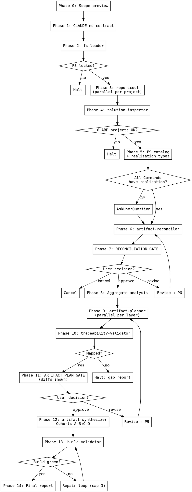

# Implementation Feed — Repo-Aware ABP Feature Code Generation

**Announce at start:** "I'm using the implementation-feed skill. Before I plan any code, I'll scan your repository for existing files that could implement the feature — DTOs, entities, AppServices, background workers, hosted services, hubs and event handlers. Then I'll compare what's there to the Feat Spec and show you a reconciliation plan (what to reuse, what to update, what to create). You approve the reconciliation, I plan the code, you approve the code plan, and only then do I write anything. Migrations remain manual."

<HARD-GATE>
- Do not write any source file, modify the solution, or run any build command before the user explicitly approves **both** the Reconciliation Plan (Phase 7) **and** the Artifact Plan (Phase 11).
- Do not consume a Feat Spec that still shows `[TODO]`, `[PENDING]`, `[TBD]`, `[PLACEHOLDER]`, or an **Open Blockers** section with critical/high Conflicts. Halt and escalate.
- Do not invent artifacts that have no FS source. Do not skip FS elements that have no artifact. Both conditions halt the skill.
- Do not assume every Command is an AppService method. Consult the FS page's execution model and the repo scout's detected patterns to pick the correct realization: AppService, BackgroundJob, IHostedService, SignalR Hub method, Event handler, or CLI command.
- Do not overwrite an existing file without an explicit `UPDATE_IN_PLACE` reconciliation decision from the user. Do not delete existing files.
- Do not duplicate an existing DTO, Entity, Validator, Mapper, Permission constant, or AppService method that already satisfies the FS — reuse it.
- Do not produce repositories or manual controllers. Do not publish domain events from the Domain layer. Do not inline user-visible strings.
- Do not run `dotnet ef migrations add` or `dotnet ef database update`. Migrations are the user's responsibility.
- Never ask questions as prose — always use the `AskUserQuestion` tool.
</HARD-GATE>

---

## Overview

This skill is the downstream counterpart to `generate-feat-spec`. It differs from a naive code generator in three ways:

1. **It scans the repo first.** Before any planning, `repo-scout` enumerates every project in the solution — not just the 6 ABP projects — and indexes candidate artifacts by name, shape, and signature. DTOs, entities, AppServices, validators, mappers, permission constants, background workers, hosted services, SignalR hubs, event handlers, and CLI commands are all catalogued.

2. **It reconciles the FS against what already exists.** `artifact-reconciler` does a three-way comparison (FS element ↔ candidate existing artifact ↔ skill's target pattern) and classifies every FS element into one of `REUSE_AS_IS`, `UPDATE_IN_PLACE`, `CREATE_NEW`, or `CONFLICT`. The user approves this plan before any code-gen planning begins.

3. **It treats Commands as pluggable in their execution model.** A Command's realization is determined per-command from the FS page's `**Execution model:**` field plus the repo's detected patterns. Not every Command becomes an AppService method; some are background jobs, hosted services, hub methods, or event handlers.

The skill still produces bidirectional traceability and still leaves migrations to the user. But it no longer assumes a greenfield solution, and it no longer forces every Command into an AppService.

---

## Core Principle

**Every FS element has exactly one reconciliation decision and one realization type. Every decision is either REUSE, UPDATE, or CREATE. Every realization is chosen from the set {AppService, BackgroundJob, IHostedService, SignalR Hub method, EventHandler, CLI command} per FS + repo evidence — never assumed.**

| FS element | Possible reconciliation | Possible realization type |
|---|---|---|
| Actor | REUSE / UPDATE / CREATE role constant | Role constant in Domain.Shared |
| Command | REUSE / UPDATE / CREATE method | AppService \| BackgroundJob \| HostedService \| HubMethod \| EventHandler \| CliCommand |
| Query | REUSE / UPDATE / CREATE method | AppService \| HubMethod (read-only) |
| Entity | REUSE / UPDATE / CREATE | Domain aggregate or child entity |
| Value Object | REUSE / UPDATE / CREATE | Domain value object |
| State | REUSE / UPDATE / CREATE enum | Domain.Shared enum |
| Permission | REUSE / UPDATE / CREATE constant + provider entry | Application.Contracts permissions |
| Error / validation message | REUSE / UPDATE / CREATE | Constants key + localization JSON |
| Business rule | REUSE / UPDATE / CREATE method | Aggregate method OR Domain Service method |
| Integration | REUSE / UPDATE / CREATE port | Declared port interface |
| Decision | — | Synthesis constraint |
| Conflict (blocking) | — | Halts the skill |

An FS element with no reconciliation decision halts the skill. A reconciliation decision with no realization type halts the skill.

---

## CLAUDE.md Convention Contract

**Required** fields block Phase 0; **recommended** emit warnings; **optional** have documented defaults.

| Field | Required | Default | Used by |
|---|---|---|---|
| `gitlab_project_id` | yes | — | Coordination-issue cross-reference |
| `wiki_url` | yes | — | Feat Spec canonical page |
| `wiki_local_path` | yes | `docs` | On-disk wiki location |
| `project_root_namespace` | yes | — | All generated namespaces |
| `src_path` | yes | `src` | Solution root to scan |
| `solution_file` | no | first `*.sln` under `src_path` | Enumeration anchor |
| `module_project_layout` | no | ABP defaults | Expected ABP project paths |
| `auxiliary_projects` | no | `[]` | Extra projects (Worker, BackgroundJobs, Hubs, Integrations, Cli) |
| `tenancy_model` | recommended | — | Aggregate interface, AppService tenant guards |
| `validation_library` | no | `FluentValidation` | Validator pattern |
| `object_mapping_library` | no | `Mapperly` | Mapper pattern |
| `permissions_class` | no | `<Feature>Permissions` | Permissions class name |
| `db_table_prefix` | no | `App` | EF Core `ToTable` |
| `sorting_strategy` | no | `explicit-switch` | Query list sorting |
| `enum_serialization` | no | `camelCase strings, global` | JSON converter |
| `api_routing_conventions` | no | ABP default | Public/Private split |
| `localization_resource_name` | no | `<Feature>Resource` | Localizer type arg |
| `background_job_library` | no | `ABP BackgroundJobs` | BackgroundJob realization |
| `hosted_service_pattern` | no | `IHostedService` | HostedService realization |
| `realtime_library` | no | none | HubMethod realization (e.g., SignalR) |
| `event_bus_library` | no | `ABP LocalEventBus` (Application layer only) | EventHandler realization |
| `cli_host_project` | no | — | CLI command host |
| `notable_gotchas` | no | — | Passed to synthesizer as context |

Missing required field → `AskUserQuestion`. Missing optional → one-line soft warning listing defaults.

---

## FS Retrieval Model

The Feat Spec lives at `<wiki_local_path>/feat-specs/<feature-slug>/feat-spec.md`. Every DDD node page lives at `<wiki_local_path>/<node-type>/<NodeName>.md`. Each Command page includes an `**Execution model:**` field; if absent, the reconciler infers from repo evidence and asks the user if ambiguous.

Halt conditions during load: Feat Spec missing, placeholder tokens, critical/high Conflicts referenced in Open Blockers, wiki-linked page missing on disk.

---

## When NOT to Use

- No Feat Spec on disk for the feature slug.
- Unresolved critical/high Conflicts.
- Placeholder tokens in the Feat Spec.
- CLAUDE.md absent or missing required fields.
- No `.sln` file under `src_path`.

---

## Quick Reference

| Phase | Action | Delegated to | Parallel? | Gate |
|---|---|---|---|---|
| 0 | Scope preview | main | — | User confirms slug + CLAUDE.md |
| 1 | CLAUDE.md convention contract | main | — | Halt if required fields missing |
| 2 | Load Feat Spec + DDD pages | `fs-loader` | Yes — per page | Halt on placeholders / broken links / blocking Conflicts |
| 3 | **Repo reconnaissance** | `repo-scout` | Yes — per project | Returns candidate index |
| 4 | Solution scaffolding check | `solution-inspector` | No | Halt only on missing 6 ABP projects or DbContext |
| 5 | FS catalog + realization assignment | main | — | Every Command has a realization type |
| 6 | **Reconciliation** | `artifact-reconciler` | No | Three-way diff; every FS element classified |
| 7 | **Reconciliation approval gate** | main (`AskUserQuestion`) | — | User approves REUSE / UPDATE / CREATE |
| 8 | Aggregate boundary analysis | main | — | Scoped to CREATE/UPDATE elements |
| 9 | Artifact planning per layer | `artifact-planner` | Yes — per layer | Plans CREATE, UPDATE edits, REUSE references |
| 10 | Traceability validation | `traceability-validator` | No | Unmapped=0, orphans=0 |
| 11 | **Artifact plan approval gate** | main (`AskUserQuestion`) | — | User approves final write/edit plan (diffs visible) |
| 12 | Code synthesis per layer | `artifact-synthesizer` | Yes — per cohort | CREATE writes new files; UPDATE applies `str_replace`; REUSE no I/O |
| 13 | Compile + validation | `build-validator` | No | `dotnet build` green; repair loop cap 3 |
| 14 | Final traceability report | main | — | Report with REUSE/UPDATE/CREATE inventory + manual next steps |

Migrations are never a phase.

---

## Parallel Dispatch

### Phase 2 — `fs-loader` per page

Parallel when ≥3 DDD node pages are linked.

### Phase 3 — `repo-scout` per project

- **Dispatch:** one worker per project, or batches of 5 for very large solutions.
- **Scope:** single project path + CLAUDE.md contract.
- **Rejoin:** main repo-scout merges indices into the solution-wide candidate catalog.
- **Safety:** read-only file scans, independent per project.

### Phase 9 — `artifact-planner` per layer

Unchanged logic; consumes the reconciliation plan; emits `create`, `update_edit`, or `reuse_reference_only` descriptors.

### Phase 12 — `artifact-synthesizer` cohort-gated

Cohorts unchanged: A (Domain.Shared) → B (Domain) → C (Application.Contracts) → D (Application + EFCore + auxiliary projects). Synthesizer handles three operation modes per descriptor — `create`, `update_edit`, `reuse_reference_only`.

### Not parallelized

- `solution-inspector` — one pass.
- `artifact-reconciler` — whole-catalog view required.
- `traceability-validator` — whole-plan view required.
- `build-validator` — one invocation.
- Repair loops — serial.

---

## Hard Rules / Constraints

<HARD-GATE>
- **Two approval gates, both absolute.** Phase 7 reconciliation and Phase 11 artifact plan each require explicit `approve`.
- **FS lock check.** No placeholders, no blocking Conflicts.
- **Bidirectional traceability.** Every FS element → at least one decision + artifact reference. Every new-or-edited artifact ← FS element.
- **Reconciliation discipline.** Every FS element carries exactly one of `REUSE_AS_IS`, `UPDATE_IN_PLACE`, `CREATE_NEW`, `CONFLICT`. No `maybe`.
- **Realization discipline.** Every Command has exactly one realization type. Ambiguous → `AskUserQuestion`.
- **No overwrites without UPDATE.** A file classified `REUSE_AS_IS` is never written. A file classified `UPDATE_IN_PLACE` is edited via `str_replace` only — never full-file rewrite.
- **No phantom creations.** If the scout's index gains a match between planning and synthesis, halt `{FILE_DRIFT}` and re-reconcile.
- **Tenancy + domain purity.** Unchanged.
- **Authorization everywhere** for AppServices. Background jobs run as scheduled identity; hosted services call AppServices/Domain Services (never raw repositories). Hub classes declare `[Authorize]`; per-method where FS says so.
- **Input DTO immutability / Mapperly / FluentValidation / explicit-switch sort / Builder pattern / permissions pair** — unchanged.
- **Manual migrations.**
</HARD-GATE>

---

## Anti-Patterns

### ❌ Generating code before scanning the repo

**Why wrong:** Duplicates, re-introduces obsolete patterns, or overwrites existing work. Drifts the codebase.

✅ **Correct:** Phase 3 is mandatory. Nothing plans or writes before scout + reconciler + user approval.

### ❌ Assuming every Command is an AppService method

**Why wrong:** Scheduled recurring work, long-running watchers, real-time broadcasts, and cross-module event reactions are not HTTP endpoints.

✅ **Correct:** Six realization types picked per FS + repo evidence. See `references/command-realizations.md`.

### ❌ Overwriting an existing file without an UPDATE decision

**Why wrong:** Silent clobber. Immediate distrust.

✅ **Correct:** Synthesizer refuses to write over a `REUSE_AS_IS` file. `UPDATE_IN_PLACE` produces a diff visible at Phase 11; synthesizer applies via `str_replace`.

### ❌ Reconciliation by name only

**Why wrong:** Same name, different shape. FS might need a field the existing DTO lacks.

✅ **Correct:** Reconciler compares fingerprints — constructor signature, properties, base class, attributes, authorization coverage. Name match + shape mismatch → `UPDATE_IN_PLACE` with explicit edits.

### ❌ Skipping reconciliation approval on a fully-greenfield feature

**Why wrong:** Confirming that nothing reuses is itself valuable and reveals any mismatch between user expectation and scout findings.

✅ **Correct:** Phase 7 gate always runs.

### ❌ Inventing a worker pattern when the project has none

**Why wrong:** Scope creep. If the repo has no BackgroundJob infrastructure, standing one up is out of scope.

✅ **Correct:** Scout reports supported realization patterns. If FS demands one the project lacks, halt and surface.

### ❌ Merging an update without showing the diff

✅ **Correct:** Phase 11 preview includes per-file unified diffs for every `UPDATE_IN_PLACE`.

### ❌ Permissions constants without Provider

✅ **Correct:** Pair always. Reconciler checks both sides.

### ❌ Running migrations inside the skill

✅ **Correct:** Manual, documented in the report.

---

## Checklist

You MUST complete these in order:

1. Phase 0 scope preview via `AskUserQuestion`.
2. Phase 1 read CLAUDE.md convention contract.
3. Phase 2 dispatch `fs-loader` (parallel ≥3 pages).
4. Phase 3 dispatch `repo-scout` (parallel per project).
5. Phase 4 dispatch `solution-inspector`.
6. Phase 5 build FS catalog + assign realization types.
7. Phase 6 dispatch `artifact-reconciler`.
8. Phase 7 **reconciliation approval gate**. Only `approve` proceeds.
9. Phase 8 aggregate boundary analysis (CREATE/UPDATE elements only).
10. Phase 9 dispatch `artifact-planner` per layer (parallel).
11. Phase 10 dispatch `traceability-validator`.
12. Phase 11 **artifact plan approval gate**. Preview shows diffs.
13. Phase 12 dispatch `artifact-synthesizer` per cohort.
14. Phase 13 dispatch `build-validator`. Repair loop cap 3.
15. Phase 14 write `IMPLEMENTATION_REPORT_<Feature>.md`.

---

## Process Flow



---

## The Process

### Phase 0: Scope Preview

1. Read feature slug from arguments. Absent → `AskUserQuestion` listing slugs.
2. Verify CLAUDE.md readable.
3. `AskUserQuestion`:
   > I'll generate ABP code for feature **<slug>**. Before planning, I'll scan the whole solution for existing files that could implement this feature — DTOs, entities, AppServices, background workers, hosted services, hubs, and event handlers. You'll approve the reconciliation plan (reuse / update / create) before I plan the code, and the code plan before I write anything. Proceed?

### Phase 1: CLAUDE.md Convention Contract

Extract fields; halt on missing required; warn on missing recommended; emit soft-warning line listing optional defaults used.

### Phase 2: FS Load (`fs-loader`)

See `agents/fs-loader.md`. Loader extracts `**Execution model:**` per Command page.

### Phase 3: Repo Reconnaissance (`repo-scout`)

See `agents/repo-scout.md`.

- **Input:** `src_path`, `solution_file`, `project_root_namespace`, `auxiliary_projects`, CLAUDE.md contract.
- **Tools:** filesystem read, `dotnet sln list`.
- **Parallel:** one worker per project.
- **Returns:** candidate catalog: `{kind, class_name, file_path, project, shape_fingerprint, declared_attributes, authorization_coverage, tenancy_aware}`.

Shape fingerprint: base class, implemented interfaces, public constructor signature, public method signatures, public properties with `init;`/`set;` markers, tenant scoping signals, authorization coverage per AppService method.

### Phase 4: Solution Scaffolding (`solution-inspector`)

Verifies 6 ABP projects + DbContext + modules. Reports auxiliary projects discovered by scout. Absence of an auxiliary project needed by an FS realization is NOT a halt — becomes a reconciliation decision.

### Phase 5: FS Catalog + Realization Assignment

Main agent.

1. Produce FS catalog from loader output.
2. Per Command, assign realization:
   - If page declares `**Execution model:**`, use it.
   - Else infer from name + FS prose:
     - `Scheduled*`, `Nightly*`, `Recurring*` → `BackgroundJob`.
     - `*Handler`, `Handle*`, `On*Async` → `EventHandler`.
     - `Broadcast*`, `Notify*`, `Push*` → `HubMethod`.
     - `Process*` for long-running watchers → `HostedService`.
     - Verb+noun invoked by user → `AppService`.
   - Ambiguous → `AskUserQuestion` per Command.
3. Realization requires absent project → flag for reconciler.

### Phase 6: Reconciliation (`artifact-reconciler`)

See `agents/artifact-reconciler.md`.

Per FS element:

1. Candidate lookup in scout catalog (filter by kind + realization + name + containing project).
2. Shape comparison (FS-implied vs. fingerprint).
3. Classify:
   - No candidate → `CREATE_NEW`.
   - Candidate with exact shape → `REUSE_AS_IS`.
   - Candidate with additive differences → `UPDATE_IN_PLACE` with edit list.
   - Candidate with conflicting shape → `CONFLICT`. Surface.
4. Realization-aware: `BackgroundJob` Command never matches an AppService with the same name.

### Phase 7: Reconciliation Approval Gate

Present plan:

```
Reconciliation Plan — <Feature Title>

REUSE_AS_IS (N):
  - <kind> <n> at <project>/<file> — matches FS exactly
  ...

UPDATE_IN_PLACE (M):
  - <kind> <n> at <project>/<file> — <reason>
      + add property <Name:Type>
      + add method <Sig>
      + add permission child <Feature:Entity:Op>
  ...

CREATE_NEW (K):
  - <kind> <n> target: <project>/<file>
  ...

CONFLICT (C):
  - <kind> <n> at <project>/<file> — <detail>
      Suggested resolution: ...
```

`AskUserQuestion`: `approve` / `revise` / `cancel`.

`revise` collects feedback and reruns reconciler with overrides. Never proceed on CONFLICT-containing plan without user-chosen resolution.

### Phase 8: Aggregate Boundary Analysis

Scoped to FS elements with `CREATE_NEW` or `UPDATE_IN_PLACE`. REUSE aggregates noted, not analyzed.

### Phase 9: Artifact Planning (`artifact-planner`)

See `agents/artifact-planner.md`. Emits descriptors: `create`, `update_edit`, `reuse_reference_only`.

### Phase 10: Traceability Validation (`traceability-validator`)

Accepts `reuse_reference_only` and `update_edit` as valid artifact references. Existing file satisfying FS counts toward forward coverage.

### Phase 11: Artifact Plan Approval Gate

Preview includes:

1. New files (path + summary + FS source).
2. Edits — unified diff per file.
3. Reuse references (path + FS element).
4. Traceability matrix.
5. CLAUDE.md defaults used.
6. Migration commands preview.

`AskUserQuestion`: `approve` / `revise` / `cancel`.

### Phase 12: Code Synthesis (`artifact-synthesizer`)

Three ops per descriptor:

- `create` → `create_file` with rendered template.
- `update_edit` → sequential `str_replace` calls matching the previewed diff. Mismatch → halt `FILE_DRIFT`.
- `reuse_reference_only` → no I/O.

Cohorts A→B→C→D serial; files within cohort parallel.

### Phase 13: Build Validation (`build-validator`)

`dotnet build`; classify errors; repair loop cap 3.

### Phase 14: Final Report

Writes `<wiki_local_path>/feat-specs/<feature-slug>/IMPLEMENTATION_REPORT_<Feature>.md` with:

1. Metadata + timestamp.
2. Reconciliation summary (counts by decision).
3. Inventory per decision (REUSE: what existed; UPDATE: what existed + what added; CREATE: what written).
4. Traceability matrix.
5. Build status.
6. Manual next steps.

---

## Handling Outcomes

**PREVIEWABLE_RECONCILIATION** — Proceed to Phase 7.
**PREVIEWABLE_ARTIFACT_PLAN** — Proceed to Phase 11.
**NEEDS_REPAIR_PLAN** — Traceability failed; targeted replan.
**NEEDS_REPAIR_BUILD** — Build failed; surgical synthesis; cap 3.
**FS_NOT_LOCKED** — Halt.
**FS_HAS_BLOCKING_CONFLICT** — Halt.
**FS_NOT_FOUND** — Halt.
**CLAUDE_MD_INCOMPLETE** — Halt.
**SOLUTION_SCAFFOLDING_MISSING** — Halt only on missing 6 ABP projects or DbContext.
**REALIZATION_AMBIGUOUS** — `AskUserQuestion` per Command.
**RECONCILIATION_CONFLICT** — User resolves at Phase 7.
**AUXILIARY_PROJECT_MISSING** — Reconciler raises; user decides.
**USER_REVISION_REQUESTED** — Re-run affected phase.
**USER_CANCELLED** — No side effects.
**FILE_DRIFT** — Existing file changed between plan and synthesis; halt, re-plan.
**BUILD_UNRECOVERABLE** — Halt after 3 repair iterations.

---

## Tool Permissions

| Tool | Purpose | Phase | Called by |
|---|---|---|---|
| Filesystem read | Wiki, CLAUDE.md, repo scan, solution inspection, pre-write reads | 1, 2, 3, 4, 12 | main + all sub-agents |
| Filesystem write | Artifact creation | 12, 14 | `artifact-synthesizer` (only after Phase 11 approval) |
| `str_replace` | Edits for UPDATE_IN_PLACE | 12 | `artifact-synthesizer` |
| `dotnet build` | Compile verification | 13 | `build-validator` |
| `dotnet sln list` | Project enumeration | 3, 4 | `repo-scout`, `solution-inspector` |
| `AskUserQuestion` | 0, 1, 5, 7, 11 | various | main |

**Not permitted:** `dotnet ef *`, `dotnet run`, `dotnet test`, `dotnet add`, network, wiki writes, GitLab writes, full-file overwrite of non-empty existing files.

---

## Sub-agent Contracts Summary

| Sub-agent | Phase | Model | Parallel? | Contract |
|---|---|---|---|---|
| `fs-loader` | 2 | Haiku | Yes — per page | `agents/fs-loader.md` |
| `repo-scout` | 3 | Sonnet | Yes — per project | `agents/repo-scout.md` |
| `solution-inspector` | 4 | Haiku | No | `agents/solution-inspector.md` |
| `artifact-reconciler` | 6 | Sonnet | No | `agents/artifact-reconciler.md` |
| `artifact-planner` | 9 | Sonnet | Yes — per layer | `agents/artifact-planner.md` |
| `traceability-validator` | 10 | Haiku | No | `agents/traceability-validator.md` |
| `artifact-synthesizer` | 12 + repair | Opus | Yes — per cohort file | `agents/artifact-synthesizer.md` |
| `build-validator` | 13 | Haiku | No | `agents/build-validator.md` |

---

## Integration

**Required before:** `generate-feat-spec` published Feat Spec + DDD pages. CLAUDE.md required fields. Solution with `.sln` + 6 ABP projects.

**Delegates to:** eight sub-agents.

**Required after:** User runs migrations, seeds permission grants, reviews code, authors tests, commits.

**Alternative:** No Feat Spec → run `generate-feat-spec` first.

---

## Reference Files

| Category | File |
|---|---|
| ABP base classes | `references/abp-base-classes.md` |
| ABP built-in entities | `references/abp-built-in-entities.md` |
| Domain aggregates + Builder | `references/domain-layer.md` |
| Domain Services | `references/domain-services.md` |
| Domain.Shared layout | `references/domain-shared-layer.md` |
| Permissions + Provider | `references/permissions.md` |
| DTOs + Validators | `references/dtos-validators.md` |
| Mapperly | `references/mapperly.md` |
| AppService patterns | `references/appservices.md` |
| EF Core configuration | `references/ef-core.md` |
| Localization | `references/localization.md` |
| **Command realization types** | `references/command-realizations.md` |
| **Update-in-place edit patterns** | `references/update-in-place.md` |
| Implementation report template | `templates/implementation-report-template.md` |

## Sub-agent Files

| Sub-agent | File |
|---|---|
| FS loader | `agents/fs-loader.md` |
| **Repo scout** | `agents/repo-scout.md` |
| Solution inspector | `agents/solution-inspector.md` |
| **Artifact reconciler** | `agents/artifact-reconciler.md` |
| Artifact planner | `agents/artifact-planner.md` |
| Traceability validator | `agents/traceability-validator.md` |
| Artifact synthesizer | `agents/artifact-synthesizer.md` |
| Build validator | `agents/build-validator.md` |

---

## Expected Output

- Reconciliation plan approved by the user.
- Artifact plan approved by the user (diffs for every update).
- Set of new C# files + set of in-place edits realizing the feature.
- `dotnet build` green.
- `IMPLEMENTATION_REPORT_<Feature>.md` documenting REUSE / UPDATE / CREATE inventory + manual next steps.
- 100% bidirectional traceability.
- No migrations run.

---

## Verification

1. ✓ Repo scanned before any planning.
2. ✓ Every Command carries a realization type.
3. ✓ Every FS element has a reconciliation decision.
4. ✓ Both approval gates passed.
5. ✓ No file overwritten without UPDATE + visible diff.
6. ✓ Build green.
7. ✓ Report written with REUSE / UPDATE / CREATE inventory.

---

## Next Step

After completing:

1. Run migration commands from the report.
2. Seed permission grants.
3. Review code + edits against wiki.
4. Author tests.
5. Commit and deploy.

→ **Return to `generate-feat-spec` for the next milestone.**
